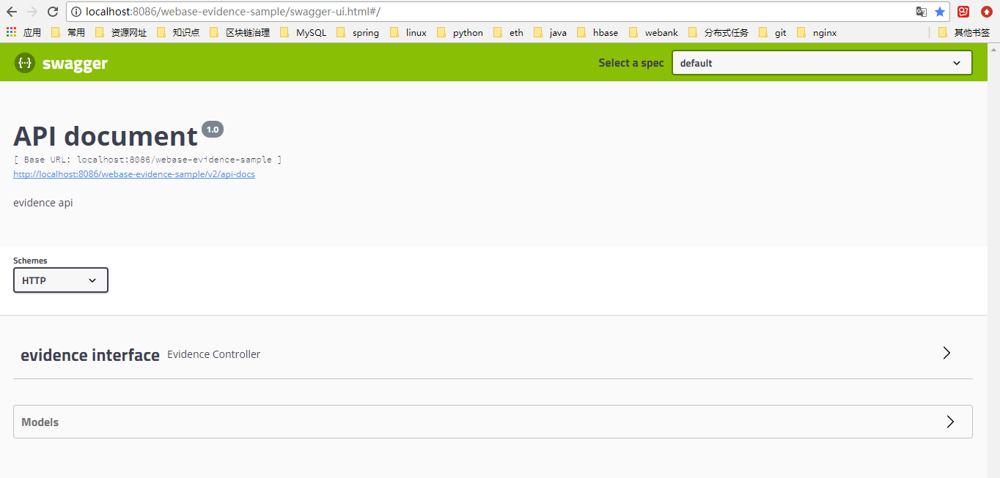
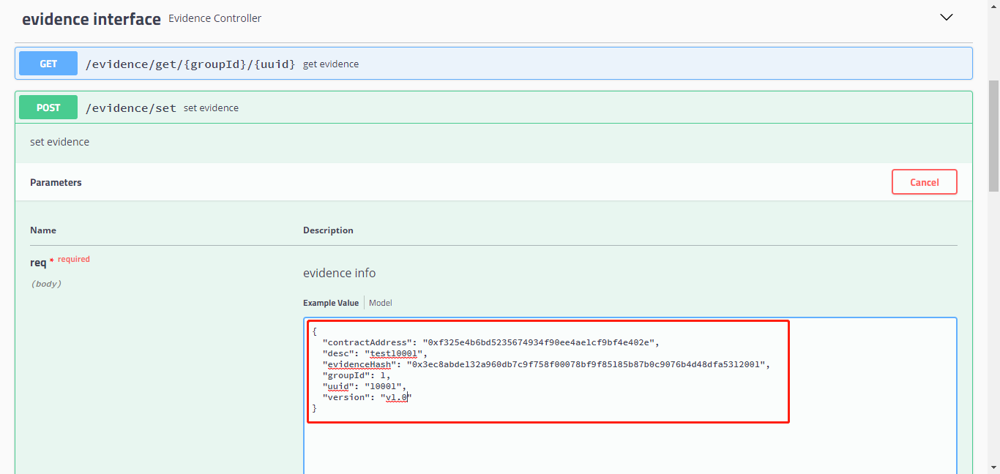
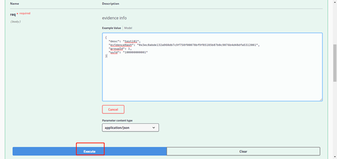
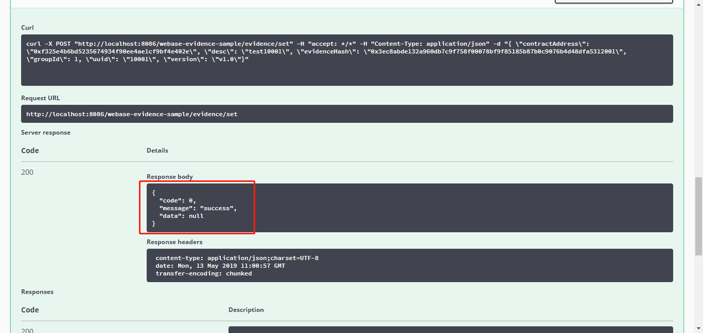
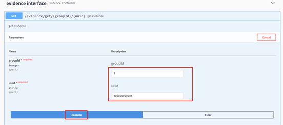
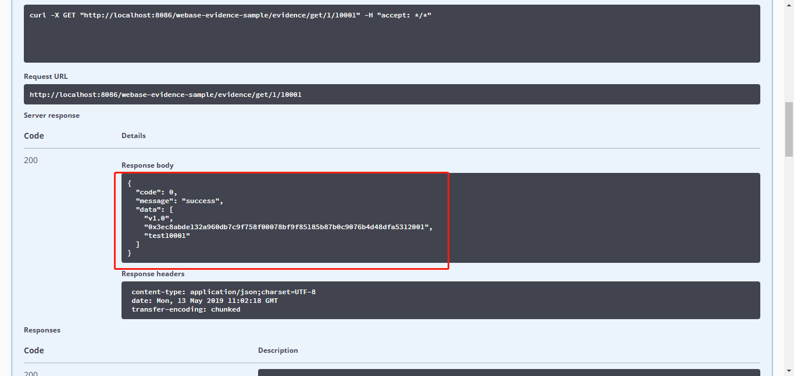

# 存证案例说明文档

[TOC]

## 1、环境

软件：jdk1.8.0_121或以上

提前部署交易服务子系统，交易服务子系统部署和说明请查看：

<https://github.com/WeBankFinTech/WeBASE-Transaction>

## 2、合约信息

本实例以简单的存证合约进行说明，主要存储数据hash和说明。以下为合约信息：

合约原文StorageCell.sol：

```
pragma solidity ^0.4.4;

contract StorageCell{

    string _storageHash;
    string _storageInfo;
    string version;
  
    constructor (string storageHash, string storageInfo) public {
       _storageHash = storageHash;
       _storageInfo = storageInfo;
    }

    function getStorageCell() public constant returns(string, string){
        
        return(_storageHash,_storageInfo);
    }
    
    function getVersion()constant returns(string){
        return version;
    }
    
    function setVersion(string n){
        version = n;
    }
}
```

合约编译后的binary：

```
608060405234801561001057600080fd5b5060405161064b38038061064b83398101806040528101908080518201929190602001805182019291905050508160009080519060200190610053929190610072565b50806001908051906020019061006a929190610072565b505050610117565b828054600181600116156101000203166002900490600052602060002090601f016020900481019282601f106100b357805160ff19168380011785556100e1565b828001600101855582156100e1579182015b828111156100e05782518255916020019190600101906100c5565b5b5090506100ee91906100f2565b5090565b61011491905b808211156101105760008160009055506001016100f8565b5090565b90565b610525806101266000396000f300608060405260043610610057576000357c0100000000000000000000000000000000000000000000000000000000900463ffffffff1680630d8e6e2c1461005c57806337a6beee146100ec578063788bc78c146101e8575b600080fd5b34801561006857600080fd5b50610071610251565b6040518080602001828103825283818151815260200191508051906020019080838360005b838110156100b1578082015181840152602081019050610096565b50505050905090810190601f1680156100de5780820380516001836020036101000a031916815260200191505b509250505060405180910390f35b3480156100f857600080fd5b506101016102f3565b604051808060200180602001838103835285818151815260200191508051906020019080838360005b8381101561014557808201518184015260208101905061012a565b50505050905090810190601f1680156101725780820380516001836020036101000a031916815260200191505b50838103825284818151815260200191508051906020019080838360005b838110156101ab578082015181840152602081019050610190565b50505050905090810190601f1680156101d85780820380516001836020036101000a031916815260200191505b5094505050505060405180910390f35b3480156101f457600080fd5b5061024f600480360381019080803590602001908201803590602001908080601f016020809104026020016040519081016040528093929190818152602001838380828437820191505050505050919291929050505061043a565b005b606060028054600181600116156101000203166002900480601f0160208091040260200160405190810160405280929190818152602001828054600181600116156101000203166002900480156102e95780601f106102be576101008083540402835291602001916102e9565b820191906000526020600020905b8154815290600101906020018083116102cc57829003601f168201915b5050505050905090565b60608060006001818054600181600116156101000203166002900480601f01602080910402602001604051908101604052809291908181526020018280546001816001161561010002031660029004801561038f5780601f106103645761010080835404028352916020019161038f565b820191906000526020600020905b81548152906001019060200180831161037257829003601f168201915b50505050509150808054600181600116156101000203166002900480601f01602080910402602001604051908101604052809291908181526020018280546001816001161561010002031660029004801561042b5780601f106104005761010080835404028352916020019161042b565b820191906000526020600020905b81548152906001019060200180831161040e57829003601f168201915b50505050509050915091509091565b8060029080519060200190610450929190610454565b5050565b828054600181600116156101000203166002900490600052602060002090601f016020900481019282601f1061049557805160ff19168380011785556104c3565b828001600101855582156104c3579182015b828111156104c25782518255916020019190600101906104a7565b5b5090506104d091906104d4565b5090565b6104f691905b808211156104f25760008160009055506001016104da565b5090565b905600a165627a7a723058201e2fc3acee78ec44951876256955cbc55a89d221447fe51e79ed52211633ba2f0029
```

合约编译后的abi：

```
[
    {
        "outputs": [
            {
                "name": "",
                "type": "string"
            }
        ],
        "constant": true,
        "payable": false,
        "inputs": [],
        "name": "getVersion",
        "stateMutability": "view",
        "type": "function"
    },
    {
        "outputs": [
            {
                "name": "",
                "type": "string"
            },
            {
                "name": "",
                "type": "string"
            }
        ],
        "constant": true,
        "payable": false,
        "inputs": [],
        "name": "getStorageCell",
        "stateMutability": "view",
        "type": "function"
    },
    {
        "outputs": [],
        "constant": false,
        "payable": false,
        "inputs": [
            {
                "name": "n",
                "type": "string"
            }
        ],
        "name": "setVersion",
        "stateMutability": "nonpayable",
        "type": "function"
    },
    {
        "payable": false,
        "inputs": [
            {
                "name": "storageHash",
                "type": "string"
            },
            {
                "name": "storageInfo",
                "type": "string"
            }
        ],
        "stateMutability": "nonpayable",
        "type": "constructor"
    }
]
```

## 3、存证和取证

### 3.1 存证

​    工程EvidenceController类下的/evidence/set接口，每次存证调用交易服务子系统的合约部署接口，需传入群组编号、部署业务流水号、签名类型、合约binary、合约abi，合约构造函数参数传入存证数据hash和说明。交易服务子系统会通过轮训服务发送上链。

### 3.2 取证

​    工程EvidenceController类下的/evidence/get接口，请求交易服务子系统的交易查询接口，传入群组编号、部署业务流水号、存证合约的“getStorageCell”方法名实时请求，返回存证数据hash和说明。

## 4、部署调用示例

​    本工程使用了swagger框架，以下通过swagger api进行调用说明。

### 4.1 修改配置

​    修改本工程resources下application.yml文件，看端口和交易服务子系统URL是否需要修改：

```
server: 
  # 本工程端口
  port: 8086
  context-path: /webase-evidence-sample

constant: 
  # 交易服务子系统URL
  transBaseUrl: http://localhost:8082/webase-transaction/%s
  
logging: 
  config: classpath:log4j2.xml
```

### 4.2 启动

​    启动本工程的Application类。

### 4.3 访问

​    服务启动后，调用swagger链接，服务ip和端口根据实际修改

​    [http://localhost:8086/webase-evidence-sample/swagger-ui.html](http://localhost:8082/webase-transaction/swagger-ui.html)



### 4.4 存证

​    输入群组编号，业务流水号，存证hash，存证说明：



​    执行：



​    执行结果（code为0代表正常）：



### 4.5 取证

​    输入群组编号和业务流水后执行：



​    执行结果（code为0代表正常）：


